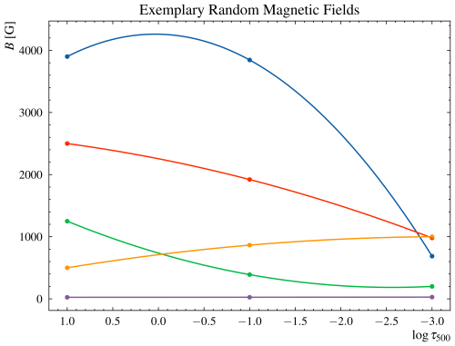

Randomising Parameters
======================

This section describes how the magnetic field, inclination, azimuth and line-of-sight velocity are randomised.

There are three options implemented: 1, 2 or 3 Nodes. The Nodes have the same meaning as in SIR (1 Node = Constant with height, 2 Nodes = Linear with height, 3 Nodes = parabolic with height).

For example, atmospheres for the magnetic field can look like this:

Note the points in the plots. These are the points used for the extrapolation from the config file. For the angles, it is made sure that there is no overshooting as otherwise angles below $0^\circ$ or above $180^\circ$ can be reached.
